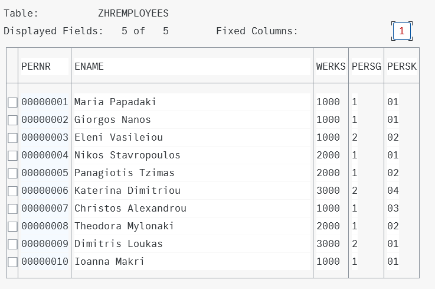
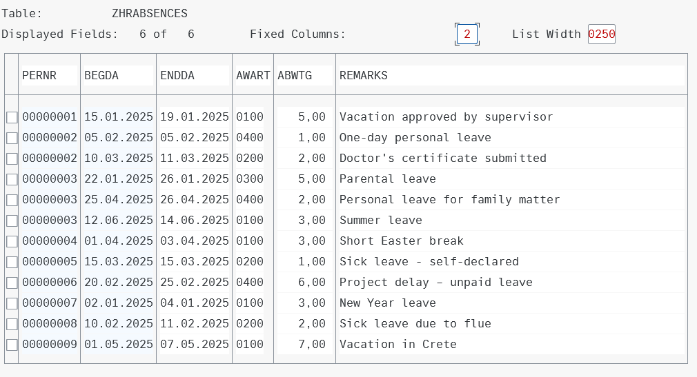
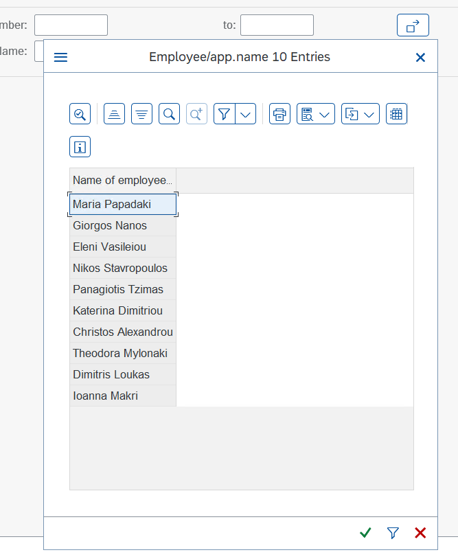
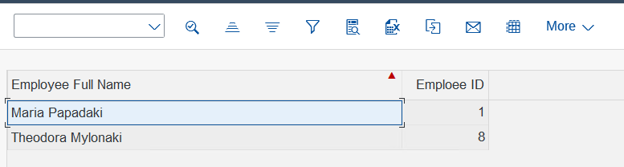
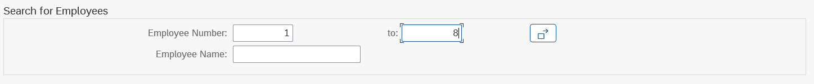
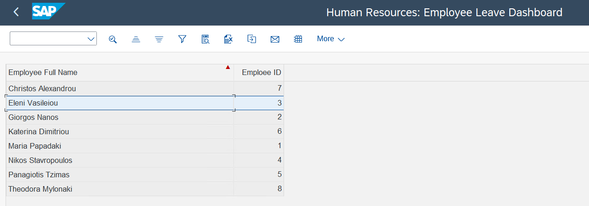
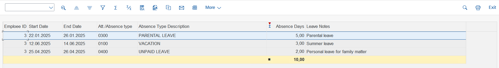

# Human Resources: Employee Leave Dashboard

This ABAP project provides an interactive **Employee Leave Dashboard** built entirely using both **Old and New ABAP Syntax**, showcasing advanced usage of the **CL\_SALV\_TABLE** class , **event handling**, and **OpenSQL data retrieval**.

The user interacts with a **custom selection screen** to find each employee's leave data, and the results are presented in an ALV grid with features such as sorting, column renaming, absence day aggregation, and double-click navigation to item-level leave details.

---

## 📋 Main Program

`zprg_hr_empleave.prog.abap`

---

## 🧩 Simulated Data Model

This project simulates core fields from **standard SAP HR tables** like `PA0001`, `PA2001`, `T554S`, and customizes the descriptive table for absence types.

## 📊 Data Sources and Field Mapping

### Custom Tables Used:

1. **ZHREMPLOYEES** (simulates PA0001)

   | Field | Description        |
   | ----- | ------------------ |
   | PERNR | Personnel Number   |
   | ENAME | Employee Full Name |

2. **ZHRABSENCES** (simulates PA2001)
   \| Field   | Description                       |
   \| PERNR   | Personnel Number (FK)             |
   \| BEGDA   | Absence Start Date                |
   \| ENDDA   | Absence End Date                  |
   \| AWART   | Absence Type Code                 |
   \| ABWTG   | Absence Days (Quantitative value) |
   \| REMARKS | Additional Notes                  |

3. **ZHRABSENCETYPES** (simulates T554S)

   | Field | Description               |
   | ----- | ------------------------- |
   | AWART | Absence Type Code (PK/FK) |
   | ATEXT | Absence Type Description  |
   | SPRAS | Language Key              |

---

## 🔗 Key Relationships

* **ZHREMPLOYEES.PERNR = ZHRABSENCES.PERNR**

  > Links each employee with their absence records.

* **ZHRABSENCES.AWART = ZHRABSENCETYPES.AWART**

  > Used to retrieve the human-readable absence description (`ATEXT`) based on the code.

---

## 🧱 Local Class Design

### `lcl_empleave`

This class is responsible for **data retrieval** and uses **two static methods** to fetch data from the database:

| Method                        | Purpose                                                                 |
|------------------------------|-------------------------------------------------------------------------|
| `fetch_empleave_header_data` | Fetches employee master data (`pernr`, `ename`) from `ZHREMPLOYEES` based on selection screen filters. |
| `fetch_empleave_item_data`   | Fetches leave details (e.g. dates, type, days, remarks) from `ZHRABSENCES` and joins with `ZHRABSENCETYPES` for descriptions. |

All internal types (structures and tables) are defined inside the class to encapsulate logic.

---

### `lcl_handling`

This local class handles **user interactions** inside the ALV Grid.

| Method                         | Purpose                                                                 |
|--------------------------------|-------------------------------------------------------------------------|
| `event_handler_double_click`   | Instance method used as an event handler for `double_click` of `cl_salv_events_table`. When a user double-clicks an employee row, it retrieves and displays their absence item data in a second ALV Grid. |

---

## 🔍 Scenario Walkthrough with Screenshots

### 1. 📁 View Table Data

Below are the contents of the custom tables that simulate SAP HR data.

 
*ZHREMPLOYEES - Simulated employee master data*

  
*ZHRABSENCES - Simulated absence records*

  
*ZHRABSENCETYPES - Simulated absence descriptions*

---

### 2. 🧾 Custom Selection Screen

The report starts with a clean selection screen for filters like name, personnel number, and date range.

--

### 3. 🔍 Custom F4 Help for Employee Name

To enhance the user experience and ensure valid input, the **Employee Name (ENAME)** field on the selection screen is enhanced with a **custom F4 Help (Search Help)**.

This custom F4 Help allows users to pick from actual employees that **have recorded absences**, improving both efficiency and accuracy.

- When the user focuses on the `ENAME` field and presses **F4**, a custom popup appears.
- The popup displays only those employees from `ZHREMPLOYEES` who have at least one entry in `ZHRABSENCES`.
- This prevents users from selecting employees who have no absences, which would return empty results.

#### F4 Help Button for Employee Name

#### Employee Names Displayed After Pressing F4

---

### 4. 🔎 Search by Name Pattern

Users can search with wildcards like `*AKI` to filter employees by name.

---

### 5. 📋 Results of Name Search

The result is an ALV showing all employees whose names match the pattern.

---

### 6. 🔢 Search by Employee Number (1–8)

Search for employees whose personnel numbers are between 1 and 8.

---

### 7. 📄 Search Results (IDs 1–8)

Search results show:

- Renamed columns (PERNR and ENAME)
- Column reordering (ENAME before PERNR)
- Alphabetical sorting by ENAME (ascending)

---

### 8. 🖱️ Double-Click to See Absence Details

Clicking on "Eleni Vasileiou" shows their leave details in a new ALV.

This ALV includes:

- Renamed columns (Absence Days, Remarks)
- Descending sort by Absence Days (`ABWTG`)
- Sum of absence days at the bottom of the column using aggregation

---

## 💡 Techniques Used

- ✅ Old & New ABAP Syntax (`DATA(...) =`, `VALUE(...)`, `TRY...CATCH`)
- ✅ Modular OpenSQL for data fetching (JOINs, filters)
- ✅ Local Class with Static Methods for business logic (data fetching)
- ✅ Local Class with Instance Methods for **event handling** (double-click)
- ✅ Dynamic ALV Grid using `CL_SALV_TABLE`:
  - `FACTORY` method
  - Functions, Sorting, aggregation, custom column text and position, events
  - Double-click handling with `SET HANDLER`

